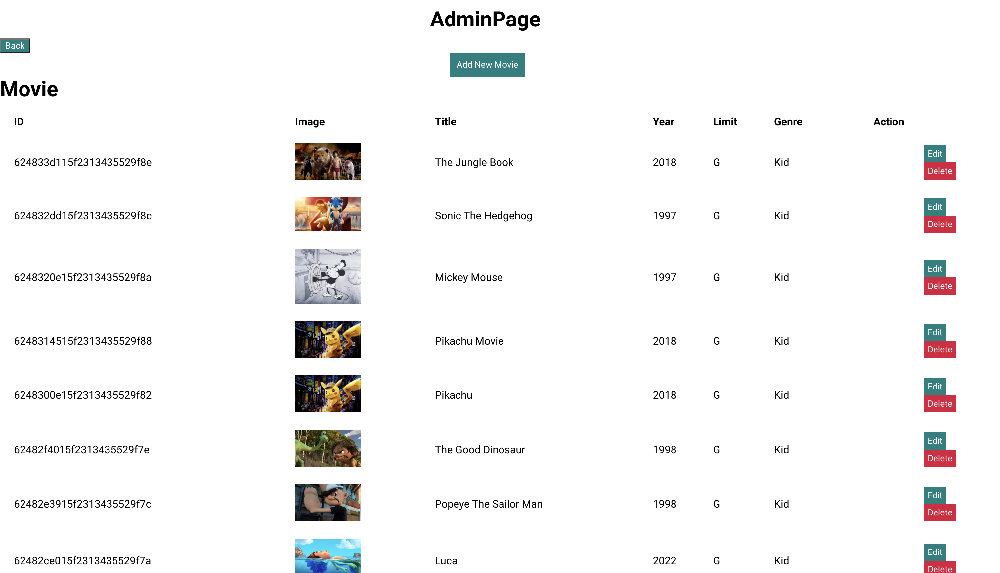
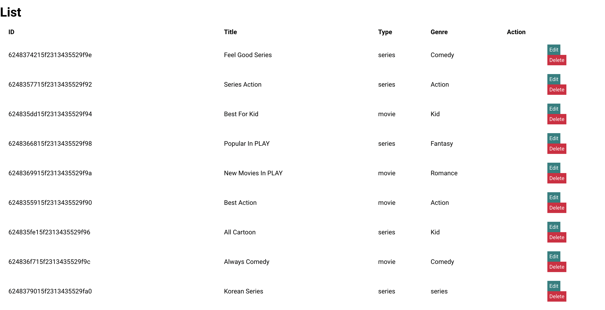
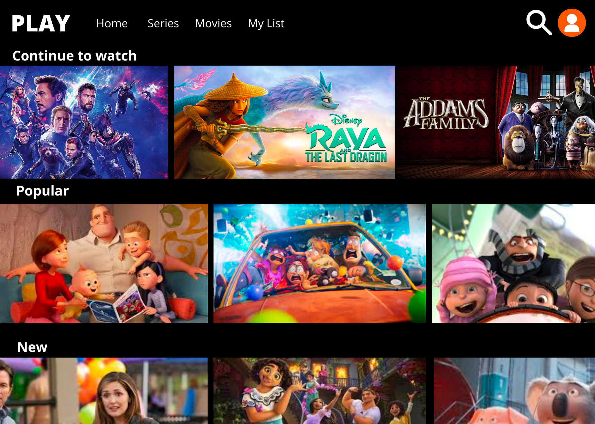
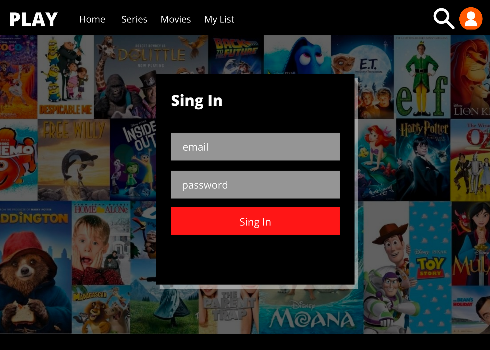

### FRONT END
# PLAY


Check out the website link here: [Play](https://playfrontend.herokuapp.com/)

### FRONT END
# Description 
Play is a web movie application which let's the user login, browse for movies and series by category, read summaries and watch a trailer, and watch the movie or series of their choice.

* Stat with the Home page. From this page users can see the options for movie or series.


* Or users can create an account by registering on this page.


* The Admin page is able to create, edit, and delete any movie lists or items.





* Anyone can enjoy watching the movies from PLAY 


# Built With
* [Node.js](https://nodejs.org/)
* [Express.js](https://expressjs.org/)
* [EJS](https://ejs.co/)
* [HTML5](https://svelte.dev/)
* [SCSS](https://sass-lang.com/)
* [React.js](https://reactjs.org)
* [Javascript](https://developer.mozilla.org/en-US/docs/Web/JavaScript)
* [MongoDB](https://www.mongodb.com)
* [Mongoose](https://mongoosejs.com)
* [JWT](https://jwt.io/)


# Installation instructions
1. Clone the repo
   ```sh
   git clone https://github.com/vorarocco/play-front-end
   ```
2. Install all NPM packages
   ```sh
   npm install

# Wire Frames



# Contact

Voravadee Rocco 
* [Voravadee Rocco LinkedIn](https://www.linkedin.com/in/voravadee-rocco/) 
* vora.rocco@gmail.com

# Improvement
